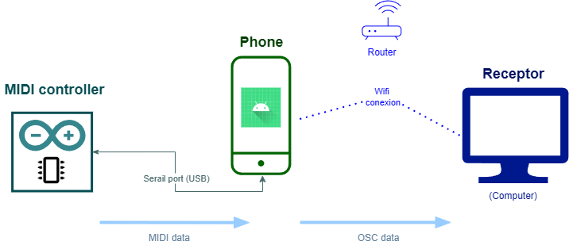
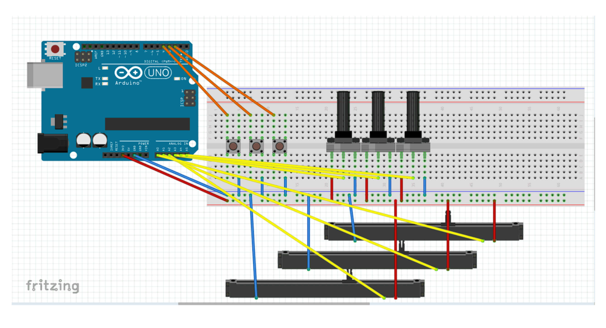
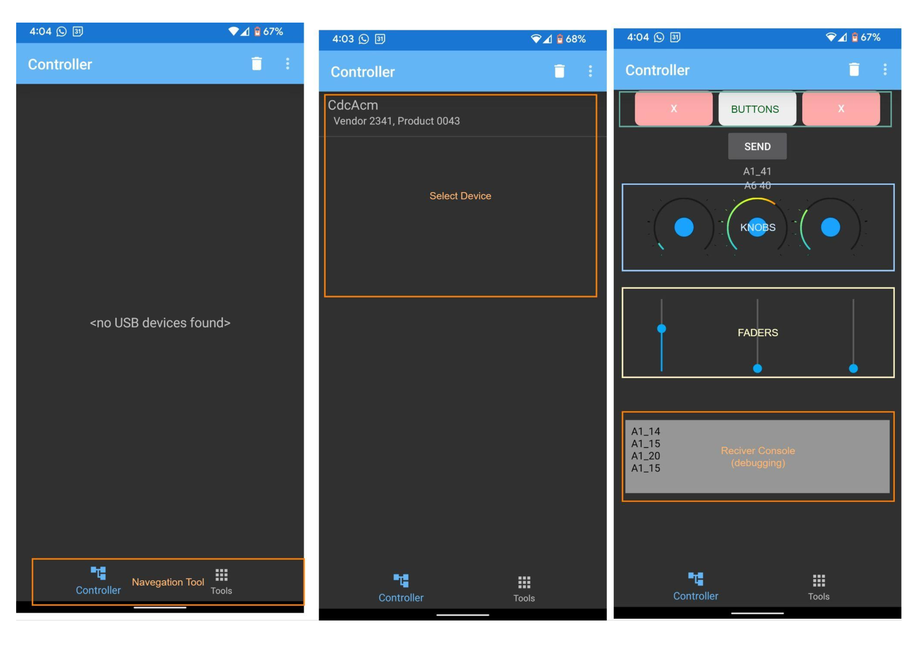
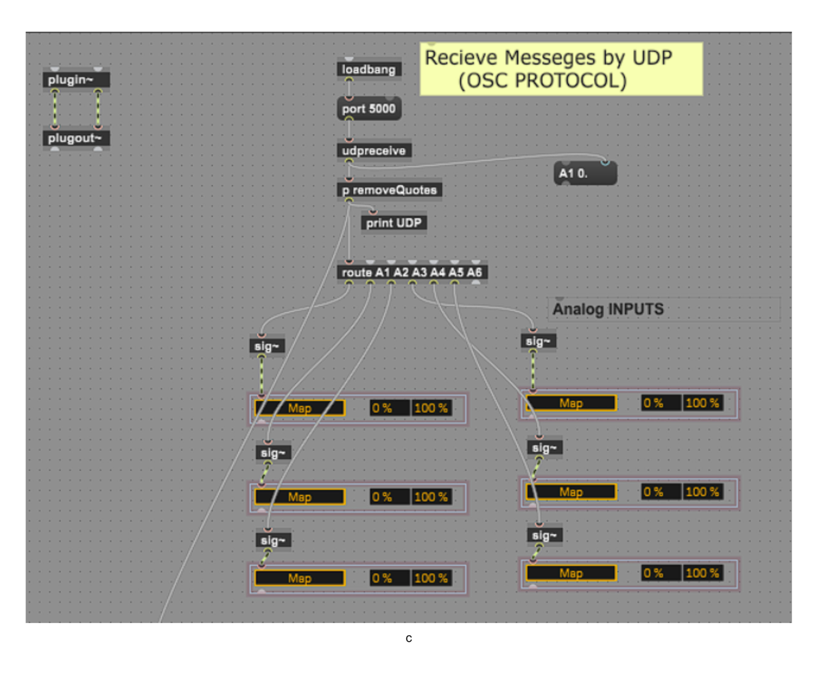
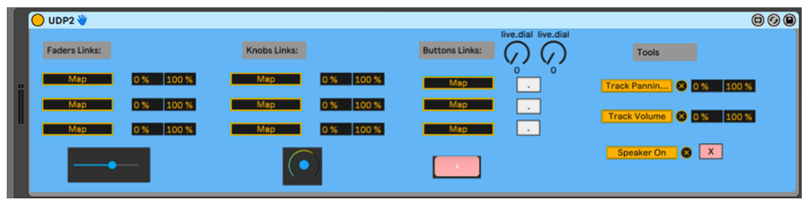

# 🎛️ Arduino–Android UDP Connection (Max for Live Communication System)

## 📌 Overview
This project implements a **bidirectional communication system** between an **Android smartphone**, an **Arduino microcontroller**, and a **Max for Live receiver** in Ableton Live.  
It enables real-time interaction between mobile devices, hardware, and music software with **low latency** and **reliable wireless communication** using UDP.

🎥 **[Watch the project demo on YouTube](https://www.youtube.com/watch?v=dqUWCqTOJeA)**

---

## ✨ Features
- 📱 **Android App**: Sends and receives control messages.
- 🤖 **Arduino Firmware**: Handles serial and wireless data communication.
- 🎶 **Max for Live Device**: Routes and processes messages in Ableton Live.
- ⚡ **Low Latency**: ~50 ms average delay using UDP.
- 🔄 **Bidirectional Communication**: Real-time message exchange.
- 🌐 **Wireless Connection**: Seamless computer integration via Wi-Fi using UDP connection.

---

## 🚀 Instructions
1. Connect both devices to the same network.
2. On the Android app, select the **hostname** (device name) to connect.
3. Use the Max for Live device to route controls to desired parameters.

---

## 🛠️ Components

### Arduino Firmware
- Built using a simple circuit with **3 knobs**, **3 faders**, and **3 buttons**.
- Sends messages via **USB serial** using the **MIDI 1.0 protocol** (3 bytes: Channel/State, Note, Velocity).
- Compatible with Arduino Uno or similar boards.
- **Location:** `arduino-firmware/MIDI_controller.ino`

---

### Android Application
- Written in **Kotlin**.
- Two main sections:
  - **Controller** – Connects to the device and mirrors the physical interface.
  - **Tools** – Software-only controls (prototype with 3 adjustable parameters).
- **Location:** `app/`

---

### Max for Live Device
- Routes and selects parameters to control in Ableton Live.
- Parameters are split into selectable controls in the interface.
- Built with **simple node coding** in Max for Live.
- **Location:** `max-for-live/UDP2.amxd`

---

## 📚 Libraries Used
Thanks to the following libraries for making this project possible:
- [usb-serial-for-android](https://github.com/mik3y/usb-serial-for-android)
- [midi-wifi-controller](https://github.com/gdsports/midi-wifi-demos)
- [rotary-buttons](https://github.com/hiennv3192/rotarybutton)

---

## 📄 License
This project is licensed under the MIT License – see the [LICENSE](LICENSE) file for details.
